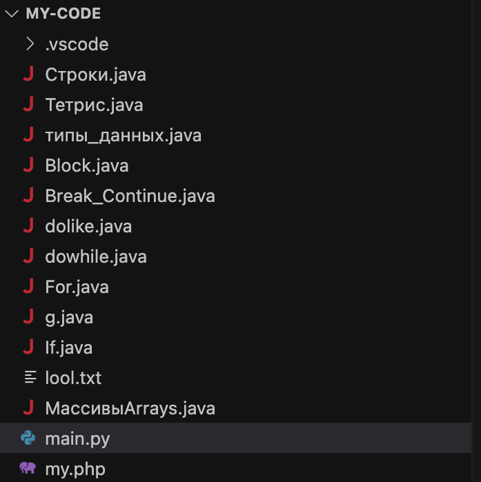
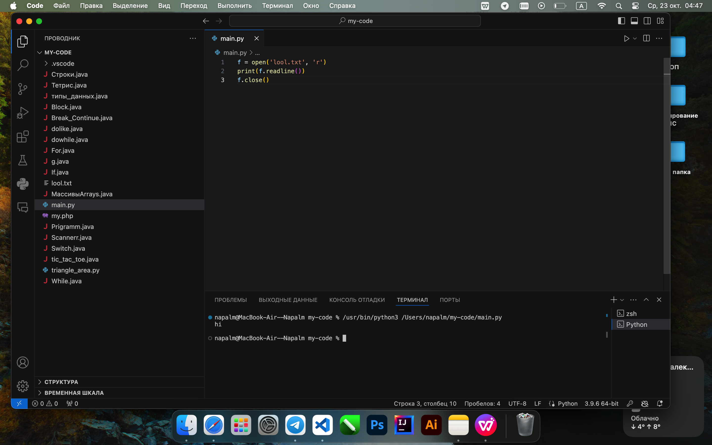
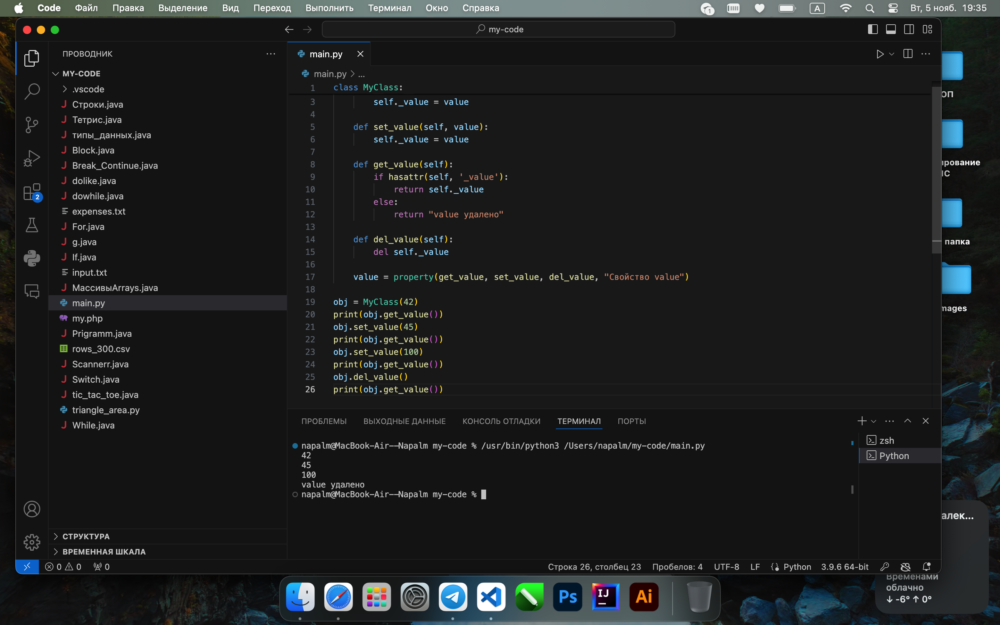
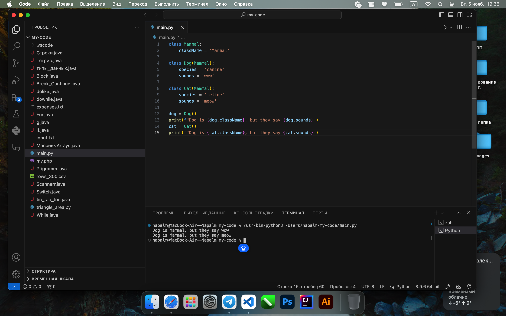
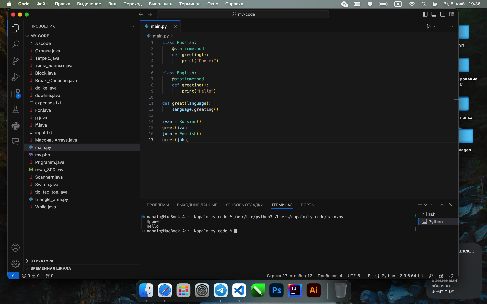
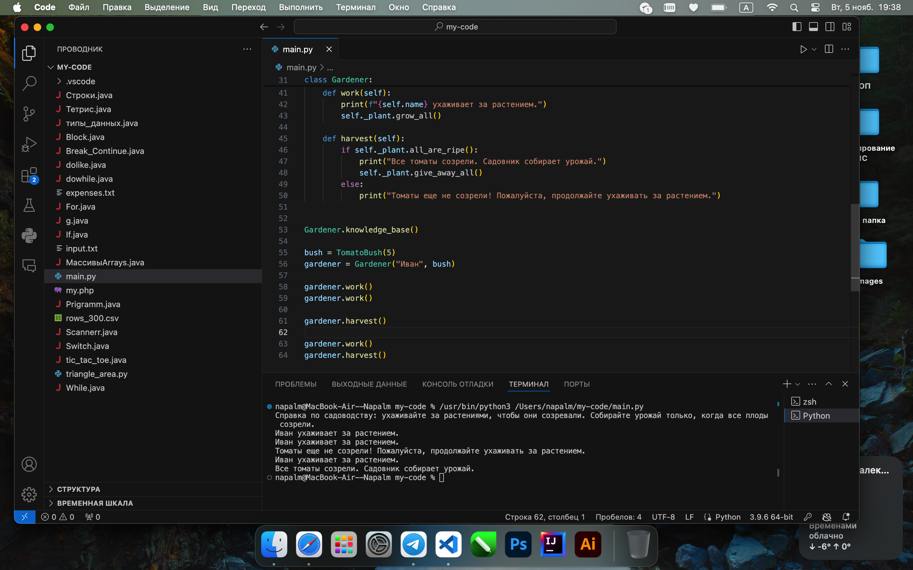

# Тема 9. ООП на Python: концепции, принципы и примеры реализации
Отчет по Теме #9 выполнил:
- Литвинов Антон Олегович
- ИВТ-22-1

| Задание    | Лаб_раб | Сам_раб |
|------------|---------|---------|
| Задание 1  | +       | +       |
| Задание 2  | +       | +       |
| Задание 3  | +       | +       |
| Задание 4  | +       | +       |
| Задание 5  | +       | +       |
| Задание 6  | -       | +       |
| Задание 7  | -       | +       |
| Задание 8  | -       | +       |
| Задание 9  | -       | +       |
| Задание 10 | -       | +       |

знак "+" - задание выполнено; знак "-" - задание не выполнено;

Работу проверили:
- к.э.н., доцент Панов М.А.

## Лабораторная работа №1
### Допустим, что вы решили оригинально и немного странно познакомится
### с человеком. Для этого у вас должен быть написан свой класс на Python, который будет проверять угадал ваше имя человек или нет. Для этого
### создайте класс, указав в свойствах только имя. Дальше создайте
### функцию __init__(), а в ней сделайте проверку на то угадал человек ваше
### имя или нет. Также можете проверить что будет, если в этой функции
### указав атрибут, который не указан в вашем классе, например, попробуйте вызвать фамилию.

```python
class Ivan:
    __slots__ = ['name']

    def __init__(self, name):
        if name == 'Иван':
            self.name = f"Да, я {name}"
        else:
            self.name = f"Я не {name}, а Иван"

person1 = Ivan('Алексей')
person2 = Ivan('Иван')
print(person1.name)
print(person2.name)
```
### Результат.



### Выводы

`__slots__ = ['name']` параметры класса

## Лабораторная работа №2
### Вам дали важное задание, написать продавцу мороженого программу, которая будет писать добавили ли топпинг в мороженое и цену после
### возможного изменения. Для этого вам нужно написать класс, в котором
### будет определяться изменили ли состав мороженого или нет. В этом
### классе реализуйте метод, выводящий на печать «Мороженое с
### {ТОППИНГ}» в случае наличия добавки, а иначе отобразится
### следующая фраза: «Обычное мороженое». При этом программа должна
### воспринимать как топпинг только атрибуты типа string.

```python
class Icecream:
    def __init__(self, ingredient=None):
        if isinstance(ingredient, str):
            self.ingredient = ingredient
        else:
            self.ingredient = None

    def composition(self):
        if self.ingredient:
            print(f"Мороженое с {self.ingredient}")
        else:
            print("Обычное мороженое")

icecream = Icecream()
icecream.composition()
icecream = Icecream('шоколадом')
icecream.composition()
icecream = Icecream(5)
icecream.composition()
```
### Результат.



### Выводы

`if isinstance(ingredient, str)` проверяем, что переменная относится к стринг

## Лабораторная работа №3
### Петя – начинающий программист и на занятиях ему сказали реализовать
### икапсу…что-то. А вы хороший друг Пети и ко всему прочему прекрасно
### знаете, что икапсу…что-то – это инкапсуляция, поэтому решаете помочь
### вашему другу с написанием класса с инкапсуляцией. Ваш класс будет не
### просто инкапсуляцией, а классом с сеттером, геттером и деструктором.
### После написания класса вам необходимо продемонстрировать что все
### написанные вами функции работают.
### Также вас необходимо объяснить Пете почему на скриншоте ниже в
### консоли выводится ошибка.

```python
class MyClass:
    def __init__(self, value):
        self._value = value

    def set_value(self, value):
        self._value = value

    def get_value(self):
        if hasattr(self, '_value'):
            return self._value
        else:
            return "value удалено"

    def del_value(self):
        del self._value

    value = property(get_value, set_value, del_value, "Свойство value")

obj = MyClass(42)
print(obj.get_value())
obj.set_value(45)
print(obj.get_value())
obj.set_value(100)
print(obj.get_value())
obj.del_value()
print(obj.get_value())
```
### Результат.



### Выводы

Создали для класса геттер и сеттер, а также функцию удаления значения
Ошибка выводилась тк мы пытались выводить удаленное значение
  
## Лабораторная работа №4
### Вам прекрасно известно, что кошки и собаки являются
### млекопитающими, но компьютер этого не понимает, поэтому вам нужно
### написать три класса: Кошки, Собаки, Млекопитающие. И при помощи
### “наследования” объяснить компьютеру что кошки и собаки – это
### млекопитающие. Также добавьте какой-нибудь свой атрибут для кошек
### и собак, чтобы показать, что они чем-то отличаются друг от друга.


```python
class Mammal:
    className = 'Mammal'

class Dog(Mammal):
    species = 'canine'
    sounds = 'wow'

class Cat(Mammal):
    species = 'feline'
    sounds = 'meow'

dog = Dog()
print(f"Dog is {dog.className}, but they say {dog.sounds}")
cat = Cat()
print(f"Dog is {cat.className}, but they say {cat.sounds}")
```
### Результат.



### Выводы

создаем класс млекопитающие и два его наследника кошку и собаку

## Лабораторная работа №5
### На разных языках здороваются по-разному, но суть остается
### одинаковой, люди друг с другом здороваются. Давайте вместе с вами
### реализуем программу с полиморфизмом, которая будет описывать всю
### суть первого предложения задачи. Для этого мы можем выбрать два
### языка, например, русский и английский и написать для них отдельные
### классы, в которых будет в виде атрибута слово, которым здороваются на
### этих языках. А также напишем функцию, которая будет выводить
### информацию о том, как на этих языках здороваются.
### Заметьте, что для решения поставленной задачи мы использовали
### декоратор @staticmethod, поскольку нам не нужны обязательные
### параметры-ссылки вроде self.


```python
class Russian:
    @staticmethod
    def greeting():
        print("Привет")

class English:
    @staticmethod
    def greeting():
        print("Hello")

def greet(language):
    language.greeting()

ivan = Russian()
greet(ivan)
john = English()
greet(john)
```
### Результат.



### Выводы

используем статические методы, а так же обычный полиморфизм

## Задания для самостоятельного выполнения: Задание Садовник и помидоры.
### 
### Классовая структура:
### Есть Помидор со следующими характеристиками:
### • Индекс
### • Стадия созревания (стадии: отсутствует, цветение, зеленый, красный) Помидор может:
### • Расти (переходить на следующую стадию созревания)
### • Предоставлять информацию о своей зрелости
### 
### Есть Куст с помидорами, который:
### • Содержит список томатов, которые на нем растут
### А также может:
### • Расти вместе с томатами
### •
### 
### Предоставлять информацию о зрелости всех томатов
### • Предоставлять урожай
### И также есть Садовник, который имеет:
### • Имя
### • Растение, за которым он ухаживает
### Он может:
### • Ухаживать за растением
### • Собирать с него урожай
### Задание:
### Класс Tomato:
### 1) Создайте класс Tomato
### 2) Создайте статическое свойство states, которое будет содержать все
### стадии созревания помидора
### 3) Создайте метод \_\_init__(), внутри которого будут определены два
### динамических свойства: _index (передается параметром) и _state
### (принимает первое значение из словаря states). После написания
### этого блока кода в комментарии к нему укажите какими являются
### эти два свойства
### 4) Создайте метод grow(), который будет переводить томат на
### следующую стадию созревания
### 5) Создайте метод is_ripe(), который будет проверять, что томат созрел
### Класс TomatoBush:
### 1) Создайте класс TomatoBush
### 2) Определите метод \_\_init__(), который будет принимать в качестве
### параметра количество томатов и на его основе будет создавать
### список объектов класса Tomato. Данный список будет храниться
### внутри динамического свойства tomatoes 3) Создайте метод grow_all(), который будет переводить все объекты
### из списка томатов на следующий этап созревания
### 4) Создайте метод all_are_ripe(), который будет возвращать True, если
### все томаты из списка стали спелыми.
### 
### 5) Создайте метод give_away_all(), который будет чистить список
### томатов после сбора урожая
### Класс Gardener:
### 1) Создайте класс Gardener
### 2) Создайте метод \_\_init__(), внутри которого будут определены два
### 
### динамических свойства: name (передается параметром, является
### публичным) и _plant (принимает объект класса TomatoBush). После
### написания этого блока кода в комментарии к нему укажите какими
### являются эти два свойства
### 3) Создайте метод work(), который заставляет садовника работать, что
### позволяет растению становиться более зрелым
### 4) Создайте метод harvest(), который проверяет, все ли плоды созрели.
### 
### Если все, то садовник собирает урожай. Если нет, то метод печатает
### предупреждение
### 5) Создайте статический метод knowledge_base(), который выведет в
### консоль справку по садоводству
### Тесты:
### 1) Вызовите справку по садоводству
### 2) Создайте объекты классов TomatoBush и Gardener 3) Используя объект класса Gardener, поухаживайте за кустом с
### помидорами
### 4) Попробуйте собрать урожай, когда томаты еще не дозрели.
### 
### Продолжайте ухаживать за ними
### 5) Соберите урожай
### Результатом работы вашей программы будет листинг кода с подробными
### комментариями и скриншоты выполенния всех тестов.

```python
class Tomato:
    states = {0: 'отсутствует', 1: 'цветение', 2: 'зеленый', 3: 'красный'}

    def __init__(self, index):
        self._index = index
        self._state = 0

    def grow(self):
        if self._state < 3:
            self._state += 1

    def is_ripe(self):
        return self._state == 3


class TomatoBush:
    def __init__(self, num_tomatoes):
        self.tomatoes = [Tomato(index) for index in range(num_tomatoes)]

    def grow_all(self):
        for tomato in self.tomatoes:
            tomato.grow()

    def all_are_ripe(self):
        return all(tomato.is_ripe() for tomato in self.tomatoes)

    def give_away_all(self):
        self.tomatoes = []


class Gardener:
    @staticmethod
    def knowledge_base():
        print("Справка по садоводству: ухаживайте за растениями, чтобы они созревали. "
              "Собирайте урожай только, когда все плоды созрели.")

    def __init__(self, name, plant):
        self.name = name
        self._plant = plant

    def work(self):
        print(f"{self.name} ухаживает за растением.")
        self._plant.grow_all()

    def harvest(self):
        if self._plant.all_are_ripe():
            print("Все томаты созрели. Садовник собирает урожай.")
            self._plant.give_away_all()
        else:
            print("Томаты еще не созрели! Пожалуйста, продолжайте ухаживать за растением.")


Gardener.knowledge_base()

bush = TomatoBush(5)
gardener = Gardener("Иван", bush)

gardener.work()
gardener.work()

gardener.harvest()

gardener.work() 
gardener.harvest()
```
### Результат.


### Выводы

1. `class Tomato:` Класс Tomato
2. `states = {0: 'отсутствует', 1: 'цветение', 2: 'зеленый', 3: 'красный'}` Стадии созревания томата
3. `def grow(self):` Метод для роста томата, переводящий его на следующую стадию
4. `def is_ripe(self):` Метод для проверки, созрел ли томат
5. `class TomatoBush:` Класс TomatoBush
6. `self.tomatoes = [Tomato(index) for index in range(num_tomatoes)]` Создаем список томатов, где каждый элемент — экземпляр класса Tomato
7. `def grow_all(self):` Метод для роста всех томатов в кусте
8. `def all_are_ripe(self):` Метод для проверки, все ли томаты созрели
9. `def give_away_all(self):` Метод для сбора урожая — очищаем куст от томатов
10. `class Gardener:` Класс Gardener
11. `def knowledge_base():` Справка по садоводству
12. `def work(self):` Метод ухода за растением
13. `def harvest(self):` Метод сбора урожая
14. `Gardener.knowledge_base()` Вызов справки по садоводству
15. `bush = TomatoBush(5)` Создаем куст с помидорами
16. `gardener = Gardener("Иван", bush)` Создаем садовника
17. `gardener.work()` Ухаживаем за кустом
18. `gardener.harvest()` Попытка сбора урожая


## Общие выводы по теме
Более глубоко и подробно освоил работу с ООП на python, закрепил все на практике
